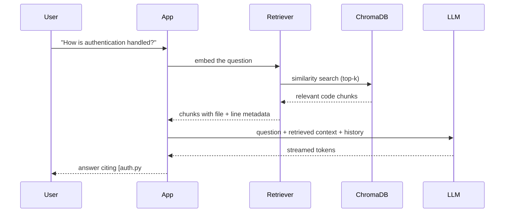
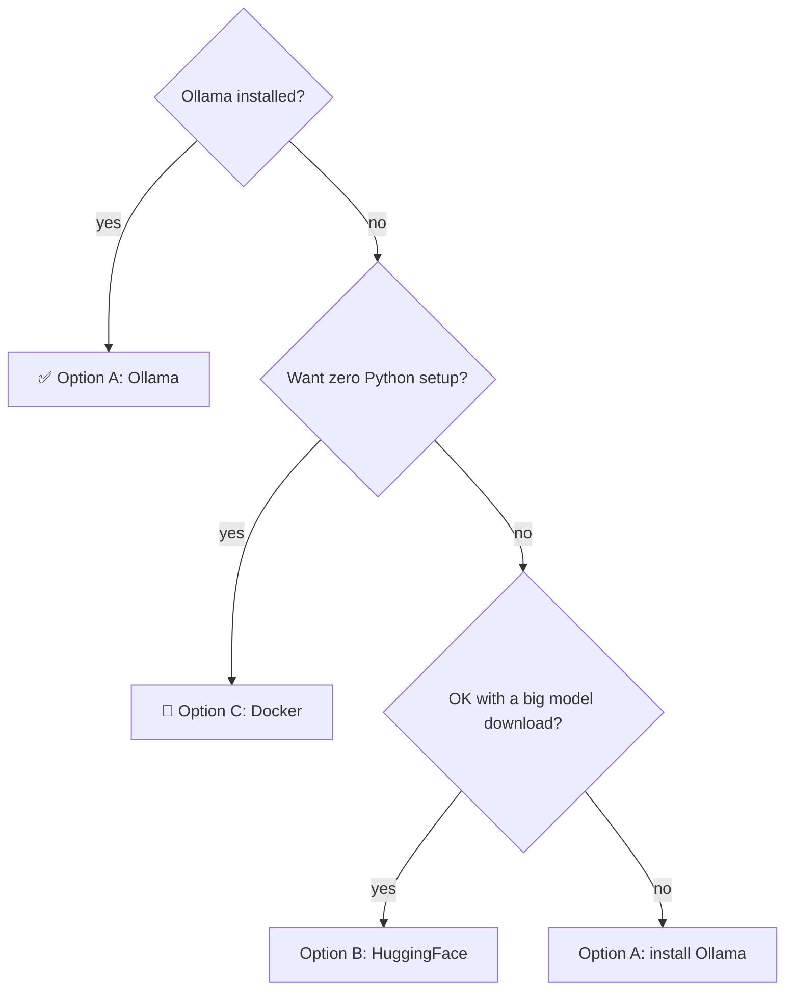
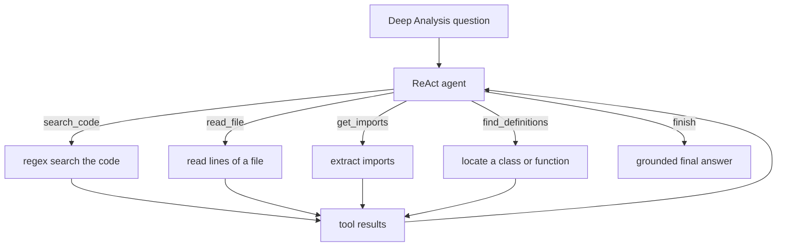
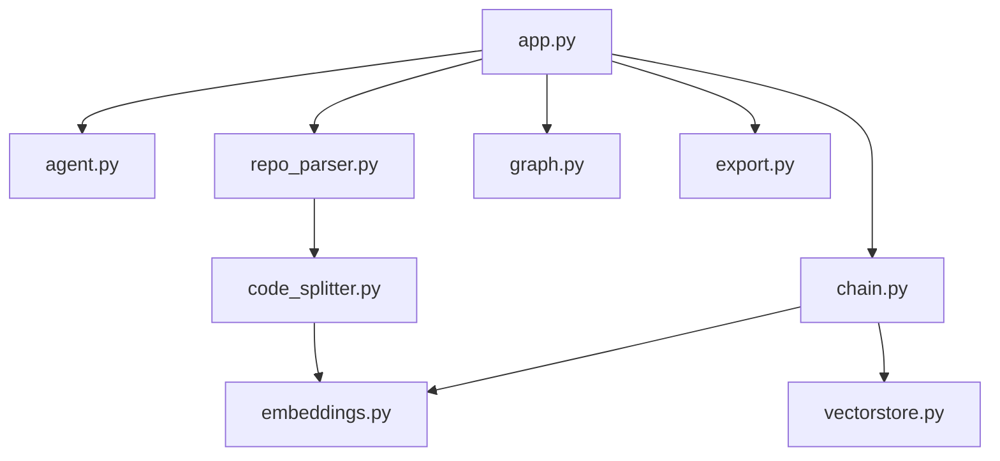

<p align="center">
  
  
  
  
  
  
</p>

<h1 align="center">CodeBase QA 🧠💬</h1>

<p align="center">
  Ever cloned a repo and spent 20 minutes spelunking for <em>one</em> function?<br>
  Now you can just <strong>ask</strong>.
</p>

<p align="center">
  Paste a <strong>GitHub URL</strong> (or a <strong>local repository path</strong>),
  index it, then chat with your code in
  plain English — and every answer comes with <strong>real file references</strong>
  you can click and verify.
</p>

<p align="center"><em>🛡️ Self-hosted. Runs fully on your machine. Your code never leaves it.</em></p>

---

## 📚 Table of Contents

- [What It Does](#what-it-does)
- [Features](#features)
- [How It Works](#how-it-works)
- [Requirements](#requirements)
- [Setup Options](#setup-options)
  - [Option A — Local with Ollama (Recommended)](#option-a--local-with-ollama-recommended)
  - [Option B — Local with HuggingFace Models](#option-b--local-with-huggingface-models)
  - [Option C — Docker](#option-c--docker)
- [Configuration](#configuration)
- [Modes: Quick vs Deep Analysis](#modes-quick-vs-deep-analysis)
- [Verify It Works](#verify-it-works)
- [Troubleshooting](#troubleshooting)
- [Running Tests & Linting](#running-tests--linting)
- [Project Structure](#project-structure)
- [Limitations](#limitations)
- [Contributing](#contributing)
- [License](#license)

---

## 🧐 What It Does

Paste a **GitHub URL**, hit **Index Repository**, and suddenly the whole
codebase is readable.

```text
💬 "What does this project do?"
💬 "How is authentication handled?"
💬 "What's the database schema?"
💬 "Explain the main function in app.py"
```

The AI reads the **actual code** (not a summary of a summary), then answers
with verifiable references:

> `[auth.py#L12-L45]` shows the login handler. It uses `passlib` with a bcrypt
> backend and issues a JWT that expires after 30 minutes.

Every citation is a clickable breadcrumb — no more trusting the model blindly.

Want more than Q&A? Switch to **Deep Analysis** mode, and an agent will search
the code, read files, and trace definitions across the whole repository on its
own — like a junior dev with a flashlight and way too much caffeine ☕.

---

## ✨ Features

| | |
|---|---|
| 🧩 **AST-Aware Code Splitting** | Python is split by function / class / import using the built-in `ast` module; JS/TS uses tree-sitter. Chunks are structural, not character-counted. |
| 🔗 **Source Links with Line Numbers** | Every answer cites `[file#Lstart-Lend]` references you can click and verify. |
| ⚡ **Streaming Responses** | Answers appear token-by-token, like a real chat. No waiting for a wall of text. |
| 💬 **Conversational Follow-ups** | Remembers your last 20 turns; older ones fold into a rolling summary. "How does it handle errors?" works right after "What's the main function?". |
| 📝 **Auto-Generated Summary** | After indexing: a one-paragraph overview, tech stack, and entry points. |
| 📊 **File Stats & Health Indicators** | File/line counts, language breakdown, and README / tests / CI checks. |
| 🕸️ **Dependency Graph** | Interactive D3.js visualization of file imports — drag, zoom, hover, gawk. |
| 🕵️ **Agentic Analysis** | A ReAct agent with code-search, file-read, import, and definition tools. |
| 📦 **Export Q&A** | Export any session as Markdown or a Jupyter notebook — take your notes with you. |
| 🔒 **Private by Default** | Everything runs locally. No cloud, no accounts, no code ever leaves your machine. |

---

## ⚙️ How It Works

Under the hood it's a classic **Retrieval-Augmented Generation (RAG)**
pipeline — with a few code-specific twists.

```mermaid
flowchart LR
    A["GitHub URL"] --> B["Clone (shallow)"]
    B --> C["Parse files"]
    C --> D["AST-aware split"]
    D --> E["Embed vectors"]
    E --> F["Store in ChromaDB"]
    F --> G["User asks a question"]
    G --> H["Retrieve top-k chunks"]
    H --> I["Prompt: question + context + history"]
    I --> J["LLM streams the answer"]
    J --> K["Answer with [file#L-L] references"]
```



**Indexing — one time per repo:**

1. **Clone** — shallow-clones the repository into a temp directory (public
   HTTPS GitHub URLs only, repos up to 50 MB).
2. **Parse** — walks supported files, collects file stats and health
   indicators (README, tests, CI/CD).
3. **Split** — the fun part:
   - **Python:** `ast` parses the file into real functions, classes, and
     imports, so a "chunk" is a whole unit of logic — never a mid-`for`-loop
     cut.
   - **JS/TS:** tree-sitter does the same structural job.
   - **Everything else:** falls back to recursive text splitting.
4. **Embed** — converts each chunk into a vector (`nomic-embed-text` via
   Ollama, or `all-MiniLM-L6-v2` via HuggingFace).
5. **Store** — persists the vectors in ChromaDB for fast similarity search.

**Asking — every time you chat:**



**What makes answers trustworthy:** the model only gets the repo overview, the
file list, the retrieved chunks, and the conversation history. The prompt
explicitly forbids guessing — if the answer isn't in the context, it says so
and points you to the right files instead. Citations come from real line
metadata, not the model's imagination.

---

## 🛠️ Requirements

| Requirement | Minimum | Check |
|---|---|---|
| 🐍 **Python** | 3.10+ | `python --version` |
| 📦 **pip** | bundled with Python | `python -m pip --version` |
| 🌿 **git** | any recent version | `git --version` |
| 🔨 **make** | any (Linux/macOS — optional on Windows) | `make --version` |

**Optional, per setup option:**

| For | Need | Notes |
|---|---|---|
| Option A | [Ollama](https://ollama.com) | ~4 GB of model downloads |
| Option C | [Docker](https://docs.docker.com/get-docker/) | containerized run |

> [!TIP]
> **Windows users:** `make` isn't bundled with Windows. Use
> `choco install make` or `scoop install make` — or just run the raw commands
> shown in each option. The Makefile is a convenience, never a requirement.

---

## 🚀 Setup Options

Pick your flavor — this diagram decides for you:



### Option A — Local with Ollama (Recommended)

Fast (1–3 s responses), free, and fully offline — the LLM and embeddings run
on your machine. Requires ~4 GB of disk for the models.

<details>
<summary><strong>Step-by-step 👇</strong></summary>

**1. Install Ollama**

| OS | Command |
|---|---|
| 🐧 Linux | `curl -fsSL https://ollama.com/install.sh \| sh` |
| 🍎 macOS | `brew install ollama` (or download from ollama.com) |
| 🪟 Windows | Download the installer from https://ollama.com/download |

Verify with `ollama --version`.

**2. Pull the models** (once, ~4 GB total)

```bash
ollama pull llama3.1
ollama pull nomic-embed-text
```

Check with `ollama list` — you should see both.

**3. Clone and install**

```bash
git clone <your-clone-url>
cd codebase-qa
make install          # creates .venv and installs dependencies
source .venv/bin/activate
```

**Windows?** Use this instead:

```powershell
python -m venv .venv
.venv\Scripts\Activate.ps1
pip install -r requirements.txt
```

> If PowerShell blocks scripts, run once:
> `Set-ExecutionPolicy -ExecutionPolicy RemoteSigned -Scope CurrentUser`

**4. Configure environment**

```bash
cp .env.example .env
```

Defaults already target Ollama — you're done. See
[Configuration](#-configuration) for every variable.

**5. Make sure Ollama is running**

```bash
curl http://localhost:11434/api/tags    # should return a JSON list
```

- 🐧 **Linux:** runs as a service after install.
- 🍎 **macOS:** `ollama serve` in a separate terminal.
- 🪟 **Windows:** runs in the system tray — make sure it's open.

**6. Run the app**

```bash
python app.py        # or: make dev
```

Open **http://localhost:7860** and index your first repository. 🎉

</details>

---

### Option B — Local with HuggingFace Models

No Ollama. Uses HuggingFace transformers — **but read this before you pick
it**:

> [!WARNING]
> This is **not** the hosted HuggingFace inference API. The model
> (`meta-llama/Llama-3.1-8B-Instruct`) is **downloaded to your machine**
> (~16 GB) and runs **on your CPU**.
>
> - Slow on CPU (tens of seconds per answer)
> - **Deep Analysis mode is unavailable** — the agent needs native
>   tool-calling, which only the Ollama path supports
> - Embeddings use `all-MiniLM-L6-v2` locally (small, ~90 MB)

Pick this if you don't want to install Ollama and can wait a bit longer.

<details>
<summary><strong>Step-by-step 👇</strong></summary>

**1–3.** Same as Option A (clone, venv, install deps) — skip Ollama entirely.

**4. Configure environment**

```bash
cp .env.example .env
```

Then edit `.env`:

```bash
LLM_PROVIDER=huggingface
EMBEDDING_PROVIDER=huggingface
```

**5. Run the app**

```bash
python app.py
```

Open http://localhost:7860. The first answer downloads the model and may take
a few minutes; subsequent answers are faster.

</details>

---

### Option C — Docker

Everything in a container — no Python dependencies on your host. The image
uses a non-root user and listens on port 7860.

<details>
<summary><strong>Build & run 👇</strong></summary>

**1. Build the image**

```bash
git clone <your-clone-url>
cd codebase-qa
docker build -t codebase-qa .
```

**2. Run with HuggingFace mode** (no Ollama needed inside the container):

```bash
docker run -p 7860:7860 \
  -e LLM_PROVIDER=huggingface \
  -e EMBEDDING_PROVIDER=huggingface \
  codebase-qa
```

> [!NOTE]
> The first answer downloads the ~16 GB model *inside* the container. For
> repeated builds, mount a volume for the model cache, or use Ollama on the host.

**3. Or run with a local Ollama** (advanced):

```bash
# Start Ollama on the host first, then:
docker run -p 7860:7860 \
  --network host \
  -e LLM_PROVIDER=ollama \
  -e EMBEDDING_PROVIDER=ollama \
  codebase-qa
```

`--network host` lets the container reach Ollama on `localhost:11434`.

Open http://localhost:7860.

</details>

---

### Quick one-liner (Linux/macOS, Ollama already installed)

```bash
git clone <your-clone-url> && cd codebase-qa && \
python -m venv .venv && source .venv/bin/activate && \
pip install -r requirements.txt && cp .env.example .env && \
python app.py
```

---

## 🧪 Configuration

All settings live in a `.env` file (copy from `.env.example`). The defaults
work out of the box for **Option A (Ollama)**.

On startup the app prints your **effective configuration** to the console, so
you always know exactly what your `.env` resolved to (your values plus any
fallbacks to defaults). No guesswork. 🎯

Your `.env` file should look like this:

```bash
# Provider selection: ollama | huggingface
LLM_PROVIDER=ollama
EMBEDDING_PROVIDER=ollama

# Ollama models
OLLAMA_MODEL=llama3.1
OLLAMA_EMBED_MODEL=nomic-embed-text

# Chunking
CHUNK_SIZE=1000
CHUNK_OVERLAP=100

# Retrieval
RETRIEVAL_K=4

# Storage
CHROMA_DIR=./chroma_db

# Features
ENABLE_AGENT=true
# Deep Analysis agent: maximum tool-call iterations before forcing a response.
MAX_AGENT_ITERATIONS=15
# Recent turns kept verbatim in the prompt; older turns fold into a rolling summary.
MAX_HISTORY_TURNS=20
```

For **Option B (HuggingFace)**, change the first two lines:

```bash
LLM_PROVIDER=huggingface
EMBEDDING_PROVIDER=huggingface
```

Here's what each variable does:

| Variable | Default | Options | Description |
|---|---|---|---|
| `LLM_PROVIDER` | `ollama` | `ollama`, `huggingface` | Which LLM backend to use |
| `EMBEDDING_PROVIDER` | `ollama` | `ollama`, `huggingface` | Which embedding backend to use |
| `OLLAMA_MODEL` | `llama3.1` | any Ollama model | LLM model name |
| `OLLAMA_EMBED_MODEL` | `nomic-embed-text` | any Ollama embedding model | Embedding model name |
| `CHUNK_SIZE` | `1000` | 100–10000 | Max characters per code chunk |
| `CHUNK_OVERLAP` | `100` | 0–500 | Overlap between chunks |
| `RETRIEVAL_K` | `4` | 1–20 | Number of chunks retrieved per query |
| `CHROMA_DIR` | `./chroma_db` | any path | Where ChromaDB stores vectors |
| `ENABLE_AGENT` | `true` | `true`, `false` | Enable the Deep Analysis agent |
| `MAX_AGENT_ITERATIONS` | `15` | 1–30 | Max tool-call iterations for Deep Analysis before forcing a response |
| `MAX_HISTORY_TURNS` | `20` | 1–20 | Conversation turns kept verbatim; older ones fold into a rolling summary |

**Rules of thumb:**

- **`LLM_PROVIDER=huggingface`** → use Quick mode only (Deep Analysis requires
  Ollama's tool-calling).
- **Larger `CHUNK_SIZE`** → fewer, richer chunks; **smaller** → more precise
  retrieval. Start at the defaults.
- **Higher `RETRIEVAL_K`** → better context for complex questions, but slower.

---

## ⚡🕵️ Modes: Quick vs Deep Analysis

| Mode | Engine | Speed | Best for |
|---|---|---|---|
| ⚡ **Quick** | RAG chain (retrieve → prompt → LLM) | 1–3 s (Ollama) | Most questions |
| 🕵️ **Deep Analysis** | ReAct agent with code tools | 10–30 s | Cross-file tracing, "find and explain" investigations |

Quick mode is your everyday sidekick. Deep Analysis is the detective that
won't stop until it's sure:



> [!NOTE]
> Deep Analysis needs a provider with **native tool-calling** — currently
> **Ollama only**. Both modes run on the same indexed repo; switch anytime.

---

## ✅ Verify It Works

After the app starts, open http://localhost:7860 and run through this list:

1. 📥 **Paste a GitHub URL** — try a small public repo, e.g.
   `https://github.com/pallets/click` or `https://github.com/pallets/flask`.
   Or paste a **local folder path** (e.g. `C:\my-project`) — it's indexed
   straight from disk, no clone, and without the 50 MB limit.
2. 🗂️ **Click Index Repository** — after a few seconds you'll see file counts,
   a language breakdown, health indicators, and an auto-generated summary.
3. 💬 **Ask "What does this project do?"** — expect a summary answer with
   `[file#Lstart-Lend]` references.
4. 🕵️ **Switch to Deep Analysis** and ask *"Find the main entry point and trace
   how it works."* — the agent should search, read, and answer (Ollama only).
5. 🕸️ **Open the Dependency Graph tab** — an interactive D3.js graph of the
   repo's files.
6. 📦 **Export a session** — pick "Markdown" (or "Notebook") and click
   **Export Chat**; a file should download.

All six working? You're set. 🚀

---

## 🔧 Troubleshooting

<details>
<summary><strong>Expand for the fixes 🔍</strong></summary>

### "No module named pip"

```bash
python -m ensurepip --upgrade
```

### "ollama: command not found"

Ollama isn't installed or isn't on your PATH.

- 🐧 Linux: `curl -fsSL https://ollama.com/install.sh | sh`
- 🍎 macOS: `brew install ollama`
- 🪟 Windows: download from https://ollama.com/download

### "Connection refused" but Ollama is installed

Ollama isn't actually running:

```bash
curl http://localhost:11434/api/tags
```

If that fails: Linux `sudo systemctl start ollama` (or `ollama serve`),
macOS `ollama serve` in its own terminal, Windows — open it from the tray.

### CUDA / GPU memory errors

Your GPU can't fit the model. Either:

1. Use a smaller model: set `OLLAMA_MODEL=llama3.2` in `.env`, or
2. Force CPU: run `OLLAMA_NUM_GPU=0 ollama serve`, or
3. Switch to Option B (HuggingFace) — it runs on CPU by design.

### "Repository is X MB, exceeds 50 MB limit"

The repo is too big. Use a smaller repo, or raise the limit in
`rag/repo_parser.py` (look for `MAX_REPO_SIZE_MB`).

### Port 7860 already in use

Another app is on that port. Either stop it, or change the port in the last
line of `app.py`:

```python
demo.launch(server_name="0.0.0.0", server_port=7861)
```

### "Failed to clone repository"

Common causes:

- **Private repo** — only public repos are supported (no auth is implemented).
- **Typo** — the URL must look like `https://github.com/user/repo`.
- **Network** — check your connection; only HTTPS URLs are accepted.

### Import errors after install

```bash
pip install --force-reinstall -r requirements.txt
```

### tree-sitter errors on Windows

`tree-sitter-languages` may fail to install on Windows. The app still works:
JS/TS falls back to regex-based splitting, and Python splitting uses the
built-in `ast` module, which always works.

### Model re-downloads on every Docker run (HuggingFace mode)

The ~16 GB model isn't persisted between containers. Mount a volume for the
HuggingFace cache:

```bash
docker run -p 7860:7860 -v hf-cache:/root/.cache/huggingface \
  -e LLM_PROVIDER=huggingface -e EMBEDDING_PROVIDER=huggingface \
  codebase-qa
```

### Makefile not found (Windows)

`make` isn't bundled with Windows. Use `choco install make` / `scoop install
make`, or run the raw commands — the Makefile is optional.

</details>

---

## 🧪 Running Tests & Linting

```bash
# Activate the venv first, then:

make test              # all tests            (or: python -m pytest tests/ -v)
make test-unit         # fast unit tests      (or: pytest tests/ --ignore=tests/test_integration.py)
make test-integration  # end-to-end pipeline  (or: pytest tests/test_integration.py)
make lint              # ruff lint            (or: ruff check .)
make format            # auto-format          (or: ruff format . && ruff check --fix .)
make format-check      # verify formatting    (or: ruff format --check .)
make help              # list all targets
```

> [!TIP]
> **131 tests**, and CI (`.github/workflows/ci.yml`) runs the same `pytest` +
> `ruff` checks on every push — the green badge isn't lying.

---

## 🗂️ Project Structure



```
codebase-qa/
├── app.py                # Gradio app: UI, AppState, event wiring
├── app_theme.py          # Custom dark theme (Gradio Base + tokens)
├── app.css               # Custom styles, layout, responsive rules
├── rag/                  # Core library
│   ├── __init__.py       #   public exports
│   ├── chain.py          #   RAG chain, LLM init, prompt template
│   ├── repo_parser.py    #   clone + parse GitHub repos, URL validation
│   ├── code_splitter.py  #   AST-aware Python + tree-sitter JS/TS splitting
│   ├── embeddings.py     #   Ollama / HuggingFace embedding providers
│   ├── vectorstore.py    #   ChromaDB: store, retrieve, clear
│   ├── summary.py        #   auto-generated codebase summary
│   ├── graph.py          #   dependency graph extraction + D3.js rendering
│   ├── agent.py          #   ReAct agent with code-search tools
│   └── export.py         #   chat export (Markdown / Jupyter notebook)
├── templates/
│   └── graph.html        # D3.js force-directed graph template
├── tests/                # 13 test modules (unit + integration)
├── .github/workflows/
│   └── ci.yml            # pytest + ruff lint/format on push/PR
├── Makefile              # install / dev / test / lint / format
├── requirements.txt      # pinned dependencies
├── pyproject.toml        # ruff + pytest configuration
├── Dockerfile            # container build (non-root user)
├── .env.example          # environment variable template
├── .dockerignore
├── .gitignore
├── README.md
└── LICENSE
```

---

## ⚠️ Limitations

- **Public repos only** — no GitHub authentication; private repos won't clone.
- **Repos up to 50 MB** — larger repos are rejected to avoid timeouts.
- **Deep Analysis needs Ollama** — the agent relies on native tool-calling;
  the HuggingFace path supports Quick mode only.
- **Option B is local, not an API** — HuggingFace mode downloads the model to
  your machine and runs it on CPU (slow first run, ~16 GB download).
- **Retrieval quality depends on chunking** — tune `CHUNK_SIZE` /
  `CHUNK_OVERLAP` for large or unusual codebases.

---

## 🤝 Contributing

1. 🍴 Fork the repository
2. 🌿 Create a branch: `git checkout -b feature/amazing-feature`
3. 🧪 Run tests: `make test`
4. ✨ Lint and format: `make lint` / `make format`
5. 📤 Commit and push, then open a Pull Request

Bug reports and feature ideas are always welcome — good ideas come from
everywhere. 💡

---

## 📄 License

[MIT](LICENSE) — do whatever you like, just keep the attribution.

---

<p align="center"><em>Built with LangChain, Gradio, a vector database, and an
unhealthy amount of curiosity.</em> 🧠</p>
