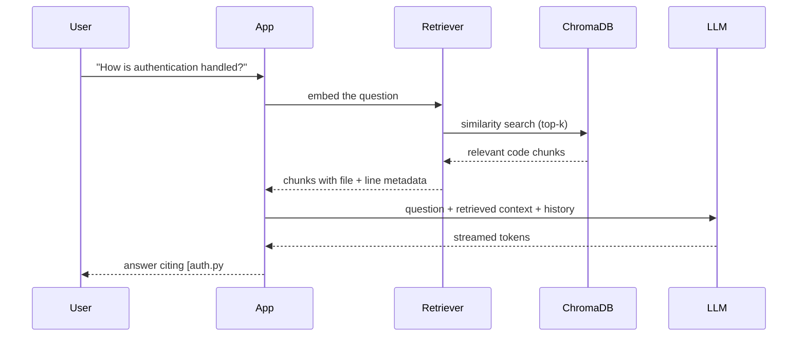
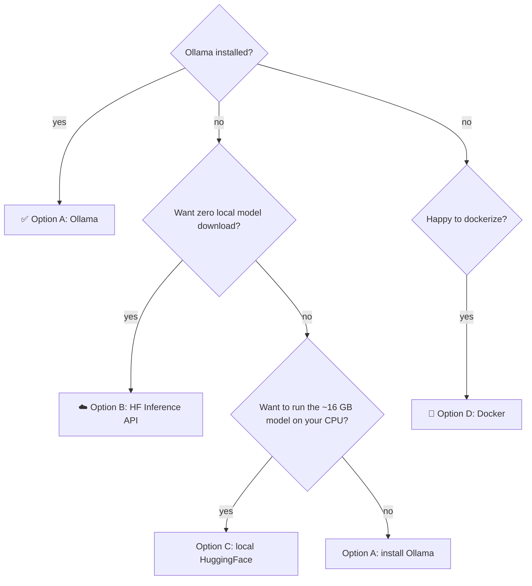
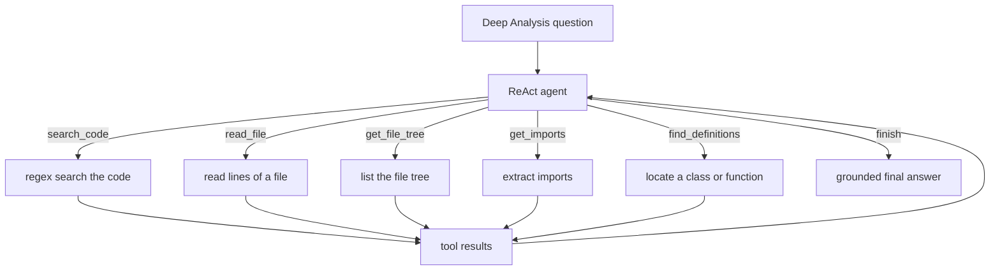

<p align="center">
  
  
  
  
  
  
</p>

<p align="center">
  
</p>

<h1 align="center">CodeBase QA 🧠💬</h1>

<p align="center">
  Ever cloned a repo and spent 20 minutes spelunking for <em>one</em> function?<br>
  Now you can just <strong>ask</strong>.
</p>

<p align="center">
  Paste a <strong>GitHub URL</strong> (or a <strong>local repository path</strong>),
  index it, then chat with your code in
  plain English — and every answer comes with <strong>real file references</strong>
  you can click and verify.
</p>

<p align="center"><em>🛡️ Self-hosted. Runs on your machine. With the local backends your code never leaves it.</em></p>

---

## 📚 Table of Contents

- [What It Does](#-what-it-does)
- [Features](#-features)
- [How It Works](#-how-it-works)
- [Architecture](#-architecture)
- [Requirements](#-requirements)
- [Setup Options](#-setup-options)
  - [Option A — Local with Ollama (Recommended)](#option-a--local-with-ollama-recommended)
  - [Option B — HuggingFace Inference API](#option-b--huggingface-inference-api)
  - [Option C — Local HuggingFace Model](#option-c--local-huggingface-model)
  - [Option D — Docker](#option-d--docker)
- [Configuration](#-configuration)
- [Modes: Quick vs Deep Analysis](#-modes-quick-vs-deep-analysis)
- [API Reference](#-api-reference)
- [Keyboard Shortcuts](#-keyboard-shortcuts)
- [Data & Persistence](#-data--persistence)
- [Verify It Works](#-verify-it-works)
- [Running Tests & Linting](#-running-tests--linting)
- [Troubleshooting](#-troubleshooting)
- [Project Structure](#-project-structure)
- [Limitations](#-limitations)
- [Contributing](#-contributing)
- [License](#-license)

---

## 🧐 What It Does

Paste a **GitHub URL** or a **local path**, hit **Index**, and the whole
codebase becomes searchable and answerable.

```text
💬 "What does this project do?"
💬 "How is authentication handled?"
💬 "What's the database schema?"
💬 "Explain the main function in app.py"
```

The AI reads the **actual code** (not a summary of a summary), then answers
with verifiable references:

> `[auth.py#L12-L45]` shows the login handler. It uses `passlib` with a bcrypt
> backend and issues a JWT that expires after 30 minutes.

Every citation is a clickable breadcrumb — click it and the file opens in an
overlay, right at the right line. No more trusting the model blindly.

Want more than Q&A? Switch to **Deep Analysis** mode, and an agent will search
the code, read files, and trace definitions across the whole repository on its
own — like a junior dev with a flashlight and way too much caffeine ☕.

---

## ✨ Features

| | |
|---|---|
| 🧩 **AST-Aware Code Splitting** | Python is split by function / class / import using the built-in `ast` module; JS/TS uses tree-sitter. Chunks are structural, not character-counted. |
| 🔗 **Source Links with Line Numbers** | Every answer cites `[file#Lstart-Lend]` references you can click and verify; file paths in answers are auto-linked too. |
| ⚡ **Streaming Responses** | Answers appear token-by-token over SSE, like a real chat. No waiting for a wall of text. |
| 💬 **Conversational Follow-ups** | Remembers your last 50 turns verbatim; older ones fold into a rolling summary. "How does it handle errors?" works right after "What's the main function?". |
| 📝 **Auto-Generated Summary** | After indexing: a one-paragraph overview, tech stack, and entry points. |
| 📊 **File Stats & Health Indicators** | File/line counts, language breakdown, and README / tests / CI checks. |
| 🕸️ **Dependency Graph** | Interactive D3.js visualization of file imports — drag, zoom, hover, gawk; filter by directory or hide tests, find a file, and click any node to read it or ask about it. |
| 🕵️ **Agentic Analysis** | A ReAct agent with search, file-read, imports, and definition tools — tool steps stream live above the answer. |
| 🔍 **Semantic Search** | Search the indexed codebase (Ctrl+K or the Search tab) — results link straight to the source with line ranges. |
| 📂 **Clickable Files** | Every file mentioned in an answer or search result opens in a line-numbered overlay; graph nodes have Read / Ask actions. |
| 🔄 **Incremental Re-indexing** | Re-running Index on the same source only re-embeds changed files (content-hash manifest) — a fast refresh, not a full rebuild. |
| 💬 **Multiple Sessions** | Save and switch between conversations from the sidebar; new sessions on Ctrl+N. Rename, delete, regenerate, copy. |
| 📦 **Export Q&A** | Export any session as Markdown or a Jupyter notebook — take your notes with you. |
| 🧩 **Two Modes** | Quick (plain RAG) or Deep Analysis (tool-using agent) — switch mid-conversation, both share the same index. |
| 🛡️ **Private by Default** | With the Ollama or local-HuggingFace backends everything runs locally. No cloud, no accounts, no code leaves your machine. |
| 🐍 **Not Just Python** | Also JS/TS, Rust, and a text fallback (markdown, yaml, JSON, etc.) — all get structural or sensible text chunks. |

---

## ⚙️ How It Works

Under the hood it's a classic **Retrieval-Augmented Generation (RAG)**
pipeline — with a few code-specific twists.

```mermaid
flowchart LR
    A["GitHub URL / local path"] --> B["Clone (shallow) / walk disk"]
    B --> C["Parse supported files"]
    C --> D["AST-aware split"]
    D --> E["Embed vectors"]
    E --> F["Store in ChromaDB"]
    F --> G["User asks a question"]
    G --> H["Retrieve top-k chunks"]
    H --> I["Prompt: question + context + history"]
    I --> J["LLM streams the answer"]
    J --> K["Answer with [file#L-L] references"]
```



**Indexing — one time per repo:**

1. **Source** — a GitHub URL is shallow-cloned into a temp directory (public
   HTTPS GitHub URLs only, repos up to 50 MB), or a local directory is walked
   straight from disk (no size limit).
2. **Parse** — supported file types are read, skipped directories ignored,
   and per-file stats collected (line count, language, README / tests / CI
   health indicators, TODO count).
3. **Split** — the fun part:
   - **Python:** `ast` parses the file into real functions, classes, and
     imports, so a "chunk" is a whole unit of logic — never a mid-`for`-loop
     cut. Large functions are split into header + body slices.
   - **JS/TS/JSX/TSX:** tree-sitter does the same structural job.
   - **Rust:** indexed as files (imports are extracted for the graph).
   - **Everything else:** falls back to recursive character splitting
     (`CHUNK_SIZE` / `CHUNK_OVERLAP`).
4. **Embed** — each chunk becomes a vector. Default: `nomic-embed-text` via
   Ollama; alternatives include `all-MiniLM-L6-v2` locally or via the
   HuggingFace Inference API.
5. **Store** — vectors persist in ChromaDB at `CHROMA_DIR` (default
   `./chroma_db`) as an `upsert` of chunk IDs that encode a per-file content
   hash.

**Re-indexing is incremental:** `vectorstore.py` keeps a `manifest.json`
mapping `file path → content hash + chunk IDs`. Unchanged files are skipped,
edited files get fresh chunk IDs (old ones deleted), removed files are pruned.
Set `INCREMENTAL_INDEX=false` to force a full rebuild instead.

**Asking — every time you chat:**



**What makes answers trustworthy:** the model only gets the repo overview, the
file list, the retrieved chunks, and the conversation history. The prompt
explicitly forbids guessing — if the answer isn't in the context, it says so
and points you to the right files instead. Citations come from real line
metadata, not the model's imagination.

---

## 🏗 Architecture

### Request Flow

```
Browser (vanilla JS, no build step) ↔ server.py (FastAPI) ↔ app.py (business logic) ↔ rag/ (library) ↔ ChromaDB
```

**`server.py`** is the single entry point. It starts a FastAPI app that:
- serves the frontend from `static/` with `Cache-Control: no-cache`
- exposes all `/api/*` routes (see [API Reference](#-api-reference))
- streams chat answers via Server-Sent Events (SSE) at `/api/chat`

**`app.py`** holds all business logic: cloning/parsing, indexing into
ChromaDB, the RAG chain, the Deep Analysis agent, the dependency graph, and
session helpers. It imports no web framework — all HTTP wiring lives in
`server.py`.

**`rag/`** is the library — importable and unit-testable on its own. Each
module owns one concern:

| Module | Responsibility |
|---|---|
| `chain.py` | LLM initialization (3 providers), prompt templates, RAG chain construction |
| `vectorstore.py` | ChromaDB upsert/search/clear, incremental re-indexing with a content-hash manifest |
| `repo_parser.py` | GitHub cloning, URL validation, local directory walking, size limits, file stats |
| `code_splitter.py` | AST-aware splitting: `ast` for Python, tree-sitter for JS/TS, text fallback for the rest |
| `embeddings.py` | Ollama / local-HuggingFace / HF Inference API embedding providers |
| `summary.py` | Auto-generated codebase overview after indexing |
| `graph.py` | Import-graph extraction (incl. Rust) + D3.js template rendering |
| `agent.py` | ReAct agent: 5 code tools + a JSON-text tool-call parser for Ollama-style models |
| `export.py` | Session export to Markdown or Jupyter notebook |

### Indexing Pipeline

1. **Clone or load** — `repo_parser.py` shallow-clones GitHub URLs (public
   only, max 50 MB) or walks a local directory directly from disk (no limit).
2. **Parse** — supported files only (`.py`, `.js`, `.ts`, `.tsx`, `.jsx`,
   `.css`, `.html`, `.md`, `.txt`, `.json`, `.yaml`, `.yml`, `.toml`, `.rs`),
   skipping `.git`, `node_modules`, `__pycache__`, `venv`, build dirs, and
   more.
3. **Split** — `code_splitter.py` produces structural chunks.
4. **Embed** — each chunk is embedded via the provider in
   [`embeddings.py`](rag/embeddings.py).
5. **Store** — vectors go to ChromaDB at `CHROMA_DIR`; re-indexing diffs
   against `manifest.json` and only re-embeds what changed.
6. **Restore on startup** — `python server.py` calls `restore_index()`, which
   reads `index_meta.json` in `CHROMA_DIR` and rebuilds the retriever, chain,
   and metadata from the previous run. For **local** sources, documents are
   re-parsed from disk so the graph, file overlay, and Deep Analysis work
   immediately; for GitHub sources, search and chat come back without
   re-cloning (re-index to restore full graph/agent).

### Chat Pipeline (Quick Mode)

```
User query → embed question → similarity_search(top-k) → format chunks with [file#L-L] → LLM prompt → stream tokens back
```

The prompt includes: repository summary, file list, top-k retrieved chunks
(with source line metadata), and conversation history (up to
`MAX_HISTORY_TURNS` turns verbatim, older turns folded into a rolling
summary maintained by the LLM).

### Deep Analysis (Agent Mode)

When `ENABLE_AGENT=true` and the LLM supports tool-calling, switching to Deep
Analysis spawns a ReAct loop with **five** tools:

| Tool | Action |
|---|---|
| `search_code` | Full-text regex search across all indexed files |
| `read_file` | Read a specific line range of a file |
| `get_file_tree` | List the indexed repository's file tree |
| `get_imports` | Extract import statements from a file |
| `find_definitions` | Locate a class/function definition with line numbers |

The agent iterates up to `MAX_AGENT_ITERATIONS` times, accumulating tool
results, then produces a grounded final answer. Each tool call streams live
above the final response. Models that emit tool calls as JSON text (common on
Ollama) are handled by a dedicated output parser in `rag/agent.py`.

### Dependency Graph

The graph view runs in an isolated `<iframe>` whose `srcdoc` is a D3.js
template from `templates/graph.html`. The backend (`graph.py`) injects graph
data as JSON into the template's `__GRAPH_DATA__` placeholder.

**Graph extraction:**
- Python imports via `ast`, JS/TS via regex import/require extraction, Rust
  via `mod`/`use` statements
- Imports are resolved to real file paths in the repo
- Produces nodes (files) and directed edges (imports), plus in/out degrees

**Frontend rendering:**
- D3.js v7, two layouts: force-directed and radial "rings" (import depth via
  Kahn longest-path)
- Cycle detection (Tarjan SCC) flagged in stats and highlights
- Filters: hide test files, filter by top-level directory, find box
- Interactions: hover for neighbors, Shift+hover for full transitive trace,
  click to pin a node and expand a focus panel, double-click to reset zoom
- Click a node for Read (opens in parent) or Ask (sends the question to chat)
  — via `postMessage({type: "cb-open-file" | "cb-ask"})`
- Respects `prefers-reduced-motion`

### Semantic Search

Ctrl+K (or the Search tab) sends the query to `/api/search`, which runs
similarity search against ChromaDB and returns one best chunk per file with
source and line range. The frontend renders clickable result cards — Open
jumps to the file overlay, Ask sends a question to chat.

### Sessions

Conversations persist in the browser's `localStorage`:
- Key `codebase-qa.session.v4` — `{ current, sessions }`
- New session: Ctrl+N or the "+" button in the header / "New Session" panel
- Switch, rename (double-click), and delete sessions from the sidebar
- Copy or regenerate any assistant reply
- Export to Markdown or Jupyter notebook via the Export panel

---

## 🛠️ Requirements

| Requirement | Minimum | Check |
|---|---|---|
| 🐍 **Python** | 3.10+ | `python --version` |
| 📦 **pip** | bundled with Python | `python -m pip --version` |
| 🌿 **git** | any recent version | `git --version` |
| 🔨 **make** | any (Linux/macOS — optional on Windows) | `make --version` |

**Optional, per setup option:**

| For | Need | Notes |
|---|---|---|
| Option A | [Ollama](https://ollama.com) | ~4 GB of model downloads |
| Option B / C | [HuggingFace token](https://huggingface.co/settings/tokens) | free tier works |
| Option D | [Docker](https://docs.docker.com/get-docker/) | containerized run |

> [!TIP]
> **No Python 3.11?** `make install` auto-detects it — if it's missing it uses
> `uv` to fetch 3.11 on the spot (or, without `uv`, prints one-line install
> instructions and waits). It targets 3.11 to match CI exactly.
>
> **Windows users:** `make` isn't bundled with Windows. Use
> `choco install make` or `scoop install make` — or just run the raw commands
> shown in each option. The Makefile is a convenience, never a requirement.

---

## 🚀 Setup Options

Pick your flavor — this diagram decides for you:



### Option A — Local with Ollama (Recommended)

Fast (1–3 s responses), free, and fully offline — the LLM and embeddings run
on your machine. Your code never leaves it.

<details>
<summary><strong>Step-by-step 👇</strong></summary>

**1. Install Ollama**

| OS | Command |
|---|---|
| 🐧 Linux | `curl -fsSL https://ollama.com/install.sh \| sh` |
| 🍎 macOS | `brew install ollama` (or download from ollama.com) |
| 🪟 Windows | Download the installer from https://ollama.com/download |

Verify with `ollama --version`.

**2. Pull the models** (once, ~4 GB total)

```bash
ollama pull llama3.1
ollama pull nomic-embed-text
```

Check with `ollama list` — you should see both.

**3. Clone and install**

```bash
git clone <your-clone-url>
cd codebase-qa
make install          # creates .venv and installs dependencies
source .venv/bin/activate
```

**Windows?** Use this instead:

```powershell
python -m venv .venv
.venv\Scripts\Activate.ps1
pip install -r requirements.txt
```

> If PowerShell blocks scripts, run once:
> `Set-ExecutionPolicy -ExecutionPolicy RemoteSigned -Scope CurrentUser`

**4. Configure environment**

```bash
cp .env.example .env
```

Defaults already target Ollama — you're done. See
[Configuration](#-configuration) for every variable.

**5. Make sure Ollama is running**

```bash
curl http://localhost:11434/api/tags    # should return a JSON list
```

- 🐧 **Linux:** runs as a service after install.
- 🍎 **macOS:** `ollama serve` in a separate terminal.
- 🪟 **Windows:** runs in the system tray — make sure it's open.

**6. Run the app**

```bash
python server.py        # or: make dev
```

Open **http://localhost:7860** and index your first repository. 🎉

</details>

---

### Option B — HuggingFace Inference API

No Ollama, no local model download. The app calls HuggingFace's hosted
Inference API (free tier available) for both the LLM and embeddings, so there
is no GPU or big download on your side.

> [!NOTE]
> **Privacy:** with this option your questions and retrieved code chunks are
> sent to HuggingFace. Use Option A or C if you need everything to stay local.

<details>
<summary><strong>Step-by-step 👇</strong></summary>

**1–3.** Same as Option A (clone, venv, install deps) — skip Ollama entirely.

**4. Get a token** at https://huggingface.co/settings/tokens.

**5. Configure environment**

```bash
cp .env.example .env
```

Then edit `.env`:

```bash
LLM_PROVIDER=huggingface_api
EMBEDDING_PROVIDER=huggingface_api
HF_TOKEN=hf_xxxxxxxxxxxxxxxxxxxxxxxxx
HF_MODEL=Qwen/Qwen2.5-7B-Instruct
```

**6. Run the app**

```bash
python server.py
```

Open http://localhost:7860. Both Quick **and Deep Analysis** work (the API
supports tool-calling).

</details>

---

### Option C — Local HuggingFace Model

No Ollama, fully offline. Uses HuggingFace transformers — **but read this
before you pick it**:

> [!WARNING]
> This is **not** the hosted HuggingFace Inference API. The LLM
> (`meta-llama/Llama-3.1-8B-Instruct`, hardcoded in `rag/chain.py`) is
> **downloaded to your machine** (~16 GB) and runs **on your CPU**.
>
> - Slow on CPU (tens of seconds per answer)
> - **Deep Analysis mode** needs tool-calling, which this local pipeline path
>   does not support — use Quick mode (or Options A/B for the agent)
> - Embeddings use `all-MiniLM-L6-v2` locally (small, ~90 MB)

<details>
<summary><strong>Step-by-step 👇</strong></summary>

**1–3.** Same as Option A (clone, venv, install deps) — skip Ollama entirely.

**4. Configure environment**

```bash
cp .env.example .env
```

Then edit `.env`:

```bash
LLM_PROVIDER=huggingface
EMBEDDING_PROVIDER=huggingface
```

**5. Run the app**

```bash
python server.py
```

Open http://localhost:7860. The first answer downloads the model and may take
a few minutes; subsequent answers are faster.

</details>

---

### Option D — Docker

Everything in a container — no Python dependencies on your host. The image
uses a non-root user and listens on port 7860.

<details>
<summary><strong>Build & run 👇</strong></summary>

**1. Build the image**

```bash
git clone <your-clone-url>
cd codebase-qa
docker build -t codebase-qa .
```

**2. Run with the HuggingFace Inference API** (no Ollama inside the
container, no big local download):

```bash
# Ollama needs --network host to reach localhost:11434 — this HF option doesn't.
docker run -p 7860:7860 \
  -e LLM_PROVIDER=huggingface_api \
  -e EMBEDDING_PROVIDER=huggingface_api \
  -e HF_TOKEN=your_token \
  codebase-qa
```

**3. Or run with a local Ollama** (advanced):

```bash
# Start Ollama on the host first, then:
docker run -p 7860:7860 \
  --network host \
  -e LLM_PROVIDER=ollama \
  -e EMBEDDING_PROVIDER=ollama \
  -e CHROMA_DIR=/app/chroma_db \
  codebase-qa
```

`--network host` lets the container reach Ollama on `localhost:11434`.

[A Docker problem?](#model-re-downloads-on-every-docker-run-huggingface-mode)

</details>

---

### Quick one-liner (Linux/macOS, Ollama already installed)

```bash
git clone <your-clone-url> && cd codebase-qa && \
python -m venv .venv && source .venv/bin/activate && \
pip install -r requirements.txt && cp .env.example .env && \
python server.py
```

---

## 🧪 Configuration

All settings live in a `.env` file (copy from `.env.example`). The defaults
work out of the box for **Option A (Ollama)**.

On startup the app prints your **effective configuration** to the console, so
you always know exactly what your `.env` resolved to. No guesswork. 🎯

```bash
# Provider selection: ollama | huggingface | huggingface_api
LLM_PROVIDER=ollama
EMBEDDING_PROVIDER=ollama

# Ollama models
OLLAMA_MODEL=llama3.1
OLLAMA_EMBED_MODEL=nomic-embed-text

# HuggingFace Inference API (free tier, no GPU needed)
# Get token at: huggingface.co/settings/tokens
HF_TOKEN=
HF_MODEL=Qwen/Qwen2.5-7B-Instruct

# Chunking
CHUNK_SIZE=1000
CHUNK_OVERLAP=100

# Retrieval
RETRIEVAL_K=4

# Storage
CHROMA_DIR=./chroma_db
INCREMENTAL_INDEX=true

# Features
ENABLE_AGENT=true
MAX_AGENT_ITERATIONS=15
MAX_HISTORY_TURNS=50
```

Here's what each variable does:

| Variable | Default | Options | Description |
|---|---|---|---|
| `LLM_PROVIDER` | `ollama` | `ollama`, `huggingface`, `huggingface_api` | Which LLM backend to use |
| `EMBEDDING_PROVIDER` | `ollama` | `ollama`, `huggingface`, `huggingface_api` | Which embedding backend to use |
| `OLLAMA_MODEL` | `llama3.1` | any Ollama model | LLM model name |
| `OLLAMA_EMBED_MODEL` | `nomic-embed-text` | any Ollama embedding model | Embedding model name |
| `HF_TOKEN` | *(empty)* | your API token | Used only by `huggingface_api` |
| `HF_MODEL` | `Qwen/Qwen2.5-7B-Instruct` | any HF-hosted model | LLM model for `huggingface_api` |
| `CHUNK_SIZE` | `1000` | 100–10000 | Max characters per code chunk |
| `CHUNK_OVERLAP` | `100` | 0–500 | Overlap between chunks |
| `RETRIEVAL_K` | `4` | 1–20 | Number of chunks retrieved per query |
| `CHROMA_DIR` | `./chroma_db` | any path | Where ChromaDB stores vectors + index metadata |
| `INCREMENTAL_INDEX` | `true` | `true`, `false` | Re-embed only changed files, or full rebuild |
| `ENABLE_AGENT` | `true` | `true`, `false` | Enable the Deep Analysis agent |
| `MAX_AGENT_ITERATIONS` | `15` | 1–30 | Max tool-call iterations for Deep Analysis |
| `MAX_HISTORY_TURNS` | `50` | any ≥1 | Conversation turns kept verbatim; older ones fold into a rolling summary |

**Rules of thumb:**

- **Local backends only for "private by default"** — `ollama` and
  `huggingface` keep everything on your machine.
  `huggingface_api` sends questions + retrieved chunks to HuggingFace.
- **`huggingface` (local)** → Quick mode only; Deep Analysis needs
  tool-calling (Ollama or `huggingface_api`).
- **Larger `CHUNK_SIZE`** → fewer, richer chunks; **smaller** → more precise
  retrieval. Start at the defaults.
- **Higher `RETRIEVAL_K`** → better context for complex questions, but slower.
- **Larger `MAX_HISTORY_TURNS`** → more context but more tokens. 50 fits a
  32k-context model; 128k-context models can go to 200+.

---

## ⚡🕵️ Modes: Quick vs Deep Analysis

| Mode | Engine | Speed | Best for |
|---|---|---|---|
| ⚡ **Quick** | RAG chain (retrieve → prompt → LLM) | 1–3 s (Ollama) | Most questions |
| 🕵️ **Deep Analysis** | ReAct agent with code tools | 10–30 s | Cross-file tracing, "find and explain" investigations |

Quick mode is your everyday sidekick. Deep Analysis is the detective that
won't stop until it's sure:



> [!NOTE]
> Deep Analysis is enabled when `ENABLE_AGENT=true` and the LLM supports
> tool-calling (Ollama models and the HuggingFace Inference API route). Both
> modes run on the same indexed repo; switch anytime.

---

## 🔌 API Reference

`server.py` (FastAPI) exposes everything the frontend uses. All `POST` bodies
are JSON.

| Method | Path | Body | Returns |
|---|---|---|---|
| `GET` | `/` | — | `static/index.html` |
| `POST` | `/api/chat` | `{message, history, mode, summary}` | SSE stream (see below) |
| `POST` | `/api/index` | `{source}` | `{status, graph_html, files}` |
| `GET` | `/api/index/status` | — | `{phase}` |
| `POST` | `/api/index/cancel` | — | `{status}` |
| `GET` | `/api/info` | — | `{provider, model, embedding, retrieval_k}` |
| `POST` | `/api/search` | `{query, k}` | `{results: [{source, start_line, end_line, snippet}]}` |
| `GET` | `/api/file` | `?path=` | `{source, total_lines, truncated, lines[]}` or `{error}` |
| `POST` | `/api/clear` | — | `{status}` |
| `GET` | `/api/graph` | — | `{graph_html}` |
| `POST` | `/api/export` | `{format_type, history}` | `{filename, content}` |

### SSE events at `/api/chat`

Each event is `data: {json}\n\n`:

| Event | Payload | Meaning |
|---|---|---|
| `delta` | `{text}` | Streaming answer tokens |
| `step` | `{text}` | A Deep Analysis tool call started (`→ tool_name`) |
| `sources` | `{items}` | Citation chips for the reply |
| `done` | `{history, summary}` | Stream finished; server-approved history |
| `error` | `{text}` | Something failed mid-stream |

---

## ⌨️ Keyboard Shortcuts

| Shortcut | Action |
|---|---|
| `Enter` | Send message |
| `Shift` + `Enter` | Newline in the composer |
| `Ctrl`/`Cmd` + `N` | New session |
| `Ctrl`/`Cmd` + `K` | Jump to Search view |
| `Esc` | Close file overlay / clear search focus |

---

## 💾 Data & Persistence

| What | Where | Notes |
|---|---|---|
| Vectors + chunks | `CHROMA_DIR/chroma.sqlite3` | ChromaDB persistent client |
| Index manifest | `CHROMA_DIR/manifest.json` | `source → {hash, ids}` for incremental re-indexing |
| Restore metadata | `CHROMA_DIR/index_meta.json` | repo name, overview, file tree, source — read at startup by `restore_index()` |
| Conversations | browser `localStorage` key `codebase-qa.session.v4` | per-browser sessions, survive server restarts |

`python server.py` runs `restore_index()` at startup, so a recent index is
usable immediately after a restart — search and chat come back first, and for
**local** sources the graph/agent/file overlay too. Re-index (Index button) to
fully restore a GitHub-sourced index.

---

## ✅ Verify It Works

After the app starts, open http://localhost:7860 and run through this list:

1. 📥 **Paste a GitHub URL** — try a small public repo, e.g.
   `https://github.com/pallets/click` or `https://github.com/pallets/flask`.
   Or paste a **local folder path** (e.g. `C:\my-project`) — it's indexed
   straight from disk, no clone, and without the 50 MB limit.
2. 🗂️ **Click Index** — you'll see file counts, a language breakdown, health
   indicators, and an auto-generated summary in the console panel.
3. 💬 **Ask "What does this project do?"** — expect a summary answer with
   `[file#Lstart-Lend]` references, plus clickable source chips under the
   reply.
4. 🕵️ **Switch to Deep Analysis** and ask *"Find the main entry point and
   trace how it works."* — the agent should search, read, and answer, with
   each tool step streamed live above the final answer.
5. 🕸️ **Open the Dependency Graph tab** — an interactive D3.js graph of the
   repo's files; filter by directory, hide tests, find a file, and click a
   node to Read or Ask about it.
6. 🔍 **Press Ctrl+K** — type a symbol name and jump straight to the code.
7. 💬 **Start a second session** (Ctrl+N) — both conversations persist and can
   be switched from the sidebar.
8. 📦 **Export a session** — Markdown or Notebook, click **Export Chat**; a
   file should download.

All working? You're set. 🚀

---

## 🧪 Running Tests & Linting

```bash
# Activate the venv first, then:

make test              # all tests            (or: python -m pytest tests/ -v)
make test-unit         # fast unit tests      (or: pytest tests/ --ignore=tests/test_integration.py)
make test-integration  # end-to-end pipeline  (or: pytest tests/test_integration.py)
make lint              # ruff lint            (or: ruff check .)
make format            # auto-format          (or: ruff format . && ruff check --fix .)
make format-check      # verify formatting    (or: ruff format --check .)
make help              # list all targets
```

> [!TIP]
> **164 tests** across 13 modules, covering the splitter, parser, graph,
> agent tools and JSON-text parser, chain, incremental indexing, persistence,
> restore, the SSE streaming API, and full pipeline integration. CI
> (`.github/workflows/ci.yml`) runs the same `pytest` + `ruff check` +
> `ruff format` gates on every push — the badge at the top isn't lying. 🟢

---

## 🔧 Troubleshooting

<details>
<summary><strong>Expand for the fixes 🔍</strong></summary>

### "No module named pip"

```bash
python -m ensurepip --upgrade
```

### "ollama: command not found"

Ollama isn't installed or isn't on your PATH.

- 🐧 Linux: `curl -fsSL https://ollama.com/install.sh | sh`
- 🍎 macOS: `brew install ollama`
- 🪟 Windows: download from https://ollama.com/download

### "Connection refused" but Ollama is installed

Ollama isn't actually running:

```bash
curl http://localhost:11434/api/tags
```

If that fails: Linux `sudo systemctl start ollama` (or `ollama serve`),
macOS `ollama serve` in its own terminal, Windows — open it from the tray.

### CUDA / GPU memory errors

Your GPU can't fit the model. Either:

1. Use a smaller model: set `OLLAMA_MODEL=llama3.2` in `.env`, or
2. Force CPU: run `OLLAMA_NUM_GPU=0 ollama serve`, or
3. Switch to Option B (HuggingFace Inference API) — no GPU needed.

### "Repository is X MB, exceeds 50 MB limit"

The repo is too big for a GitHub clone. Use a smaller repo, index it as a
**local path** (no limit), or raise the cap in `rag/repo_parser.py` (look for
`MAX_REPO_SIZE_MB`).

### Port 7860 already in use

Another app is on that port. Stop it, or change the port in the last line of
`server.py`:

```python
uvicorn.run("server:server", host="0.0.0.0", port=7860, log_level="info")
```

### "Failed to clone repository"

Common causes:

- **Private repo** — only public repos are supported (no auth is implemented).
- **Typo** — the URL must look like `https://github.com/user/repo`.
- **Network** — check your connection; only HTTPS URLs are accepted.

### Deep Analysis says "not available for this repository"

Deep Analysis needs `ENABLE_AGENT=true` **and** an LLM with tool-calling. Two
common causes:

- The source was restored from a previous run and documents aren't in memory —
  just click **Index** again.
- The provider can't bind tools (local `huggingface` pipeline). Switch to
  Ollama or `huggingface_api`.

### Import / startup errors after install

```bash
pip install --force-reinstall -r requirements.txt
```

If `fastapi` / `uvicorn` are missing specifically, ensure you installed the
current `requirements.txt` (these ship since the FastAPI migration).

### tree-sitter errors on Windows

`tree-sitter-languages` may fail to install on Windows. The app still works:
JS/TS files fall back to whole-file text chunks (split by the recursive
splitter), and Python splitting uses the built-in `ast` module, which always
works.

### Model re-downloads on every Docker run (HuggingFace mode)

If you use local HuggingFace mode in Docker, the ~16 GB model isn't persisted
between containers. Mount a volume for the HuggingFace cache:

```bash
docker run -p 7860:7860 -v hf-cache:/root/.cache/huggingface \
  -e LLM_PROVIDER=huggingface -e EMBEDDING_PROVIDER=huggingface \
  codebase-qa
```

(Prefer `huggingface_api` in Docker to avoid the download entirely.)

### Makefile not found (Windows)

`make` isn't bundled with Windows. Use `choco install make` / `scoop install
make`, or run the raw commands — the Makefile is optional.

</details>

---

## 🗂️ Project Structure

```
codebase-qa/
├── server.py             # FastAPI app: API routes + SSE chat streaming, startup restore
├── app.py                # core logic: indexing, chain, agent, graph, helpers (no web deps)
├── rag/                  # Core library
│   ├── __init__.py       #   public exports
│   ├── chain.py          #   RAG chain, LLM init (3 providers), prompt template
│   ├── repo_parser.py    #   clone + parse GitHub repos, local paths, URL validation
│   ├── code_splitter.py  #   AST-aware Python + tree-sitter JS/TS splitting + text fallback
│   ├── embeddings.py     #   Ollama / local-HF / HF-API embedding providers
│   ├── vectorstore.py    #   ChromaDB: incremental indexing, retrieve, search, clear
│   ├── summary.py        #   auto-generated codebase summary
│   ├── graph.py          #   dependency graph extraction (Python/JS/Rust) + D3 rendering
│   ├── agent.py          #   ReAct agent: 5 code tools + JSON-text tool-call parser
│   └── export.py         #   chat export (Markdown / Jupyter notebook)
├── templates/
│   └── graph.html        # D3.js interactive graph template (force + radial layouts)
├── static/               # vanilla-JS frontend, no build step
│   ├── index.html        #   app shell: sidebar, chat, search, graph, overlay
│   ├── app.js            #   SSE streaming, sessions, search, graph embedding, shortcuts
│   └── style.css         #   dark OLED theme
├── tests/                # 13 test modules (unit + integration) — 164 tests
├── .github/workflows/
│   └── ci.yml            # pytest + ruff lint/format on push/PR
├── Makefile              # install / dev / test / lint / format
├── requirements.txt      # dependencies (incl. fastapi, uvicorn, pydantic)
├── pyproject.toml        # ruff + pytest configuration
├── Dockerfile            # container build (non-root user, port 7860)
├── .env.example          # environment variable template (matches code defaults)
├── .dockerignore
├── .gitignore
├── README.md
└── LICENSE
```

---

## ⚠️ Limitations

- **Public GitHub URLs only** — no GitHub authentication; private repos won't
  clone (local paths always work).
- **GitHub clones up to 50 MB** — larger repos are rejected to avoid timeouts
  (local paths have no limit).
- **Deep Analysis needs a tool-calling provider** — Ollama or
  `huggingface_api`; the local `huggingface` pipeline supports Quick mode
  only.
- **Restore is best-effort** — after a restart, GitHub-sourced indexes come
  back for search/chat immediately, but the graph and Deep Analysis need a
  re-index to fully rebuild in memory. Local-sourced indexes restore fully.
- **`huggingface_api` is not offline** — your questions and retrieved chunks
  are sent to HuggingFace. Use `ollama` or local `huggingface` for full
  privacy.
- **Retrieval quality depends on chunking** — tune `CHUNK_SIZE` /
  `CHUNK_OVERLAP` for large or unusual codebases.

---

## 🤝 Contributing

1. 🍴 Fork the repository
2. 🌿 Create a branch: `git checkout -b feature/amazing-feature`
3. 🧪 Run tests: `make test`
4. ✨ Lint and format: `make lint` / `make format`
5. 📤 Commit and push, then open a Pull Request

> 💡 Only `README.md` ships to GitHub from the docs — `*.md` is gitignored.
> Write your session notes in any other `.md` file and they stay local.

Bug reports and feature ideas are always welcome — good ideas come from
everywhere. 💡

---

## 📄 License

[MIT](LICENSE) — do whatever you like, just keep the attribution.

---

<p align="center"><em>Built with LangChain, ChromaDB, FastAPI, Ollama — and an
unhealthy amount of curiosity.</em> 🧠</p>